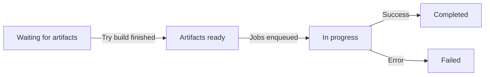
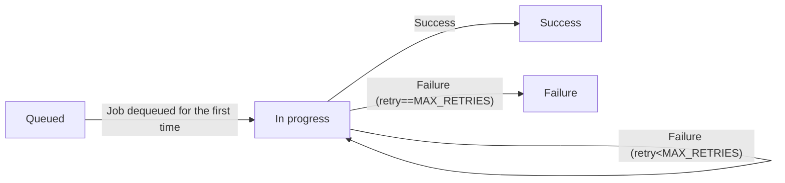

# Job queue

> Before reading this document, please examine the [glossary](./glossary.md), in particular the part about the [job queue](./glossary.md#job-queue).

In addition to simple local execution of benchmarks, `rustc-perf` can also serve as a distributed system that supports benchmarking a single compiler artifact in parallel across several collector (machines) that can even run on various hardware architectures. This distributed system is documented in this file.

Another overview of how the rustc-perf benchmark suite operates can found [here](https://kobzol.github.io/rust/rustc/2023/08/18/rustc-benchmark-suite.html), although that was written before `rustc-perf` supported multiple machines.

## High-level overview
There are two main entities operating in the distributed system:
- The [website](https://perf.rust-lang.org) receives requests for benchmarking a specific version of the compiler, splits those requests into more granular chunks of work ("jobs"), waits until all (non-optional) jobs of a request are completed and then reports the benchmark results on the corresponding pull request via a comment on GitHub.
- A set of collectors (dedicated machines) repeatedly poll for new jobs appearing. After they dequeue a job, they benchmark all test cases from it and store the results into the database.

The website communicates with the collectors through a Postgres database, there is no other external service for managing the job queue.

Let's walk through the distributed system step by step.

## Website
The main goal of the website in the distributed system is to create benchmark requests, split them into jobs, and wait until they are completed. The website has a periodically executed background process ("cron") that checks whether some progress can be made.

### Creating benchmark requests
The main event that starts the whole benchmarking process is the creation of a single benchmark request. Benchmark requests are stored in the database in the `benchmark_request` column.

They come in three types:

- Master: benchmark a commit merged into the `rust-lang/rust`'s default branch.
  - Master requests are created in the cron, once new commits appear in `rust-lang/rust`.
- Try: benchmark a try build on a given PR.
  - Try requests are created by commands sent in GitHub comments in a PR.
- Release: benchmark a released stable/beta version of Rust.
  - Release requests are created in the cron, once a new release is made.

Every benchmark request has a *parent* request, with which its benchmark results will be compared once it is finished. A parent request should generally always be benchmarked before its children.

The benchmark request can be in one of four states, whose state diagram is shown below:



Some useful observations:
- Try requests start in the `Waiting for artifacts` state, while master and release requests already start in the `Artifacts ready` state.
- A request cannot start being benchmarked until its compiler artifacts are available on CI.
- Once a request moves into the `Completed` or `Failed` state, its state will never change again.
  - New jobs can still be generated for such a request though, see [backfilling](#backfilling) below.

### Benchmark request queue
Since multiple requests can be ready to be benchmarked at any given time, the website orders them in a queue, which is displayed on the [status page].

The ordering of the queue is somewhat ephemeral, as it can change anytime a new benchmark request appears. That being said, the website also tries to avoid "jumps" in the queue when requests are completed, for better predictability of when a given request benchmark will be completed.

The ordering looks approximately like this:
1. `In progress` requests.
2. Release requests, sorted by date and then name.
3. `Artifacts ready` requests. These requests are sorted topologically, with the topological level determined by the transitive number of parents that are not done yet. So requests with a done parent have priority between requests whose parent isn't done yet.

Within the individual groups, requests are ordered by their PR number and creation time.

Currently, the website maintains an invariant that at most a single benchmark request is `In progress`. This means that even if one of the collectors is finished with all its jobs, it will have to wait until all other jobs of the request are complete. This helps us synchronise the benchmarking workload so that it is easier to keep track of what is going on in the system. This constraint could be relaxed in the future, most of the system should be prepared for running multiple requests at the same time. Although if the workflow is well-balanced, it should not be needed.

### Enqueuing jobs
The cron periodically scans the benchmark request queue. Once it sees that no benchmark request is `In progress`, and there is at least a single request that is in the `Artifacts ready` state, it will atomically transition that request to the `In progress` state and enqueue a set of benchmark jobs for the request into the `job_queue` database table.

Each benchmark job describes a subset of test cases of the whole request that will be benchmarked on a single collector. More specifically, it states which test cases (profile, codegen backend and target), benchmark suite (compile, runtime or rustc) and which *benchmark set* (a subset of the compile benchmark suite) should be benchmarked.

The jobs exist so that we can split the request into smaller chunks, which can then be benchmarked in parallel on multiple collectors, thus shortening the whole benchmark run duration. This granularity also allows us to have collectors with different hardware architectures, and support [backfilling](#backfilling).

Each job can exist in the following four states:


Once the jobs have been enqueued, the website will repeatedly check in the cron whether all (non-optional[^optional]) of the `In progress` request and also all jobs of its parent (see [backfilling](#backfilling)) have been completed. Once that happens, it will then transition the request into the `Completed` or `Failed` state (based on whether there were any failed jobs or not) and send a GitHub pull request comment with the benchmark result (for master and try requests).

[^optional]: Some jobs can be marked as optional; this is designed to allow running experimental collectors that should not "block" the main benchmark request workflow.

#### Benchmark set
Each job contains a specific *benchmark set*, a small integer that identifies which subset of the compile benchmark suite should be benchmarked in the job. This is used to further split the compile benchmark suite, which takes the most time to run, and thus enable parallelizing its execution across multiple collectors.

The compile benchmark suite for a given target is split into `N` benchmark sets. To run the suite, `N` collectors (with benchmark sets `0, 1, ..., N`) have to be available.

Each collector has a hard-coded benchmark set that it always benchmarks. Benchmarks should ideally not move within the sets, to ensure that each benchmark will always be benchmarked on the same machine, to avoid unnecessary environment noise.

That being said, sometimes it might be useful to balance the sets a little bit, to ensure that all collectors can run their jobs in approximately the same duration, to avoid unbalanced workloads.

The fact that the benchmark sets are assigned to collectors *statically* and there is no load balancing or work-stealing going on in-between the sets means that if one of the collectors stops running, **it will halt the whole system**. In that case, a [manual intervention](./deployment.md) might be required.

#### Backfilling
When the website enqueues jobs of a request, it also enqueues the jobs with the same parameters for its parent request. Parents should always be benchmarked before their children, so in most cases, all the parent jobs will already be present in the job queue.

However, someone can create a try request with *non-default* parameters. For example, they could request benchmarking `cranelift` codegen backend, which is not normally benchmarked on master requests. When that happens, we need to ensure that we will also run those non-default jobs for the *parent* in addition to the try request itself, otherwise we wouldn't have anything to compare to.

This situation is called `backfilling`. When the website enqueues jobs for a request with non-default parameters, it will create *new jobs* also for its parent request, which did not exist before. The collectors will then go and also benchmark those parent jobs, thus "backfilling" the results into a request that was already completed previously. The status of the parent request does not change when this happens, it stays `Completed` or `Failed`.

## Collectors

The main job of each collector is to continuously dequeue jobs from the job queue, run all of their benchmarks and store the results into the database.

### Registration
Individual collectors have to be registered in the database, so that we can show their status on the [status page], even if they were offline at the moment.

Their information is stored in the `collector_config` table. Each collector has its assigned benchmark set and target, which are used to determine which jobs the collector will handle.

To register a new collector, you can run the following command:

```bash
cargo run --bin collector add_collector \
  --collector_name "<name>" \
  --target <target> \
  --benchmark_set "<benchmark-set>" \
  --is_active
```

Collector names and `(target, benchmark_set)` combinations have to be unique.

If a given collector is not used anymore, it can be marked in the database as being inactive. This currently has to be done manually by modifying the database.

### Dequeuing jobs
To run a collector with a given name, you can run the following command:
```bash
cargo run --bin collector benchmark_job_queue --collector_name "<name>"
```

After starting, the collector will enter a loop in which it will repeatedly (every 30s) poll the `job_queue` table, looking for a job that matches its target and benchmark set. If it finds such a job, it will atomically dequeue it, marking it as being `In progress`, and increasing its [retry counter](#failure-handling-and-retries). Then it will download the compiler artifacts[^artifacts-cache] specified by the job and perform all its test cases.

[^artifacts-cache]: The artifacts are cached on disk, to avoid re-downloading the same artifacts multiple times, as every benchmark request will generate several jobs for each active collector.

### Failure handling and retries
Several kinds of failures can happen during the execution of a job:
- Handled transient failure: it was not possible to download CI artifacts because of a transient network error, or it was not possible to communicate with the DB. In this case, the collector will try to record the error into the `errors` table. The job will not be marked as completed, it will simply be dequeued later again, after a short wait.
- Handled permanent failure: some error that is most likely unrecoverable has happened (for example, CI artifacts for the given compiler `SHA` are not available). In this case, the collector will record the error and immediately mark the job as failed and moves on.
- Unhandled failure (panic): the collector failed unexpectedly and could not record the error (we currently don't catch panics). In this case the `collector` service will restart the collector later, and it will try to dequeue the job again.

If the collector dequeues a job that already has its retry counter set to `MAX_RETRIES` (see [job lifecycle](#enqueuing-jobs) diagram), it will mark the job as failed.

The collector prioritizes continuing `In progress` jobs before starting new `Queued` jobs.

### Automatic git update
The collector is executed through a [bash script](../collector/collect-job-queue.sh), which runs it in a loop (in case it ends or crashes). Before the collector is started, the bash script downloads the latest version of `rustc-perf` from GitHub, and rebuilds the collector, to keep it up to date.

If there are always enough jobs to benchmark, the collector might not exit for some time. The collector thus also checks the latest `rustc-perf` commit SHA while it is running. If it determines that a new version is available, it shuts itself down to let the bash script update it. However, the collector tries to delay the shutdown until after it finishes all jobs of a request that is currently `In progress`, to avoid changing the collector version in a single benchmark run. 

### Heartbeat
The collector periodicaly updates its last heartbeat date, which is displayed on the [status page]. When the heartbeat is too old, the collector will be marked as being `Offline`.

[status page]: https://perf.rust-lang.org/status.html
